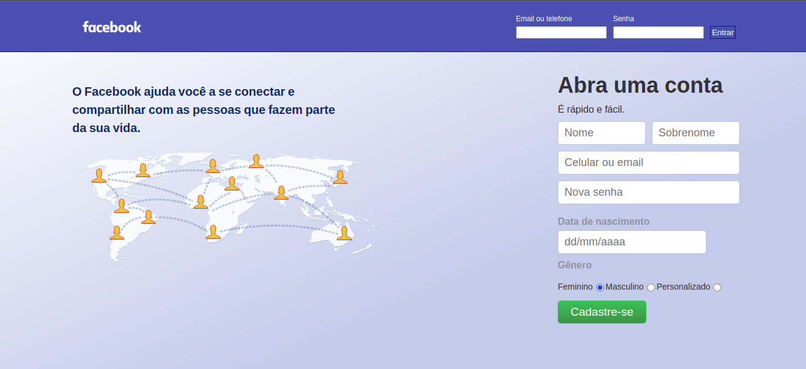

<h1 align="center">
    
</h1>

## **SOBRE**
Projeto criado dentro do módulo de Fundamentos na **Trybe**.
O objetivo principal era em clonar a página de login antiga do Facebook.

### **Habilidades**
- Criar formulários em HTML;

- Utilizar CSS Flexbox para criar layouts flexíveis;

- Criar regras CSS específicas para serem aplicadas a dispositivos móveis;

- Construir páginas que alteram o seu layout de acordo com a orientação da tela;

### **TÉCNOLOGIAS UTILIZADAS**
- HTML
- CSS
- JavaScript

### **OBS:**

O projeto foi criado em dupla, todo o código foi planejado e criado utilizando **Zoom**, **Slack** e **GitHub**.
Para que o projeto fosse avaliado pela Trybe, o código é analisado pelo ESLint para garantir que estejam sendo aplicadas as melhores práticas.

